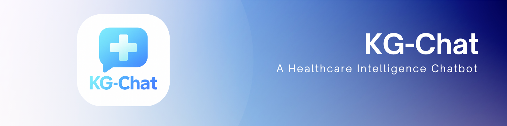

# 🤖 KG-Chat 

A specialized chatbot that uses a dual-level knowledge graph to provide accurate and comprehensive information about diabetes. The system leverages a combination of general concepts (Level 1) and specific medical details (Level 2) to deliver contextualized responses to user queries.

## ✨ Features

- **🔄 Dual-Level Knowledge Graph**: Combines general concepts with specialized medical knowledge
- **🔍 Vector Search Integration**: Uses similarity search for retrieving relevant information
- **🧠 Intent Analysis**: Automatically detects user intent to provide appropriate responses
- **🔑 Keyword Extraction**: Identifies high-level and low-level keywords to improve retrieval accuracy
- **💬 Conversational Interface**: Simple web interface built with Streamlit for easy interaction

## 🏗️ Architecture

The project consists of several key components:

- **⚙️ FastAPI Backend**: Handles query processing and knowledge graph interactions
- **🗄️ Neo4j Database**: Stores the knowledge graph structure with nodes and relationships
- **🔍 Qdrant Vector Database**: Stores vector embeddings for similarity search
- **🖥️ Streamlit Frontend**: Provides a user-friendly interface for interacting with the chatbot
- **🧠 Ollama**: Provides local embeddings generation
- **🤖 Gemini API**: Powers the natural language understanding and response generation

## 📋 Prerequisites

- 🐍 Python 3.8+
- 🐳 Docker (optional, for containerized deployment)
- 🗄️ Neo4j Database
- 🔍 Qdrant Vector Database
- 🧠 Ollama (for local embeddings)
- 🔑 Gemini API Key

## 🔧 Installation

### 📥 Clone the Repository

```bash
git clone https://github.com/yourusername/kg-chatbot.git
cd kg-chatbot
```

### 🔐 Set Up Environment Variables

Create a `.env` file in the project root with the following variables:

```
# Neo4j Configuration
NEO4J_URI=neo4j+s://your-neo4j-instance.neo4j.io
NEO4J_USERNAME=neo4j
NEO4J_PASSWORD=your-password

# Qdrant Configuration
QDRANT_HOST=localhost
QDRANT_PORT=6333

# Ollama Configuration
OLLAMA_MODEL=llama3:8b
OLLAMA_EMBEDDING_MODEL=mxbai-embed-large
OLLAMA_HOST=http://localhost:11434

# Gemini API Keys
GEMINI_API_KEY_1=your-gemini-api-key-1
GEMINI_API_KEY_2=your-gemini-api-key-2
GEMINI_API_KEY_3=your-gemini-api-key-3
GEMINI_API_KEY_4=your-gemini-api-key-4
GEMINI_API_KEY_5=your-gemini-api-key-5
```

### 📦 Install Dependencies

```bash
pip install -r app/requirements.txt
```

### 🗄️ Installing Neo4j

#### Windows

1. Download Neo4j Desktop from [Neo4j Download Page](https://neo4j.com/download/)
2. Install and open Neo4j Desktop
3. Create a new project and add a database
4. Start the database and note the connection URI, username, and password

#### macOS

1. Using Homebrew:
   ```bash
   brew install neo4j
   ```
2. Start Neo4j:
   ```bash
   neo4j start
   ```
3. Set initial password:
   ```bash
   neo4j-admin set-initial-password <your-password>
   ```

#### Linux (Ubuntu/Debian)

1. Install Neo4j:
   ```bash
   wget -O - https://debian.neo4j.com/neotechnology.gpg.key | sudo apt-key add -
   echo 'deb https://debian.neo4j.com stable latest' | sudo tee -a /etc/apt/sources.list.d/neo4j.list
   sudo apt-get update
   sudo apt-get install neo4j
   ```
2. Start Neo4j:
   ```bash
   sudo systemctl start neo4j
   ```
3. Set initial password:
   ```bash
   sudo neo4j-admin set-initial-password <your-password>
   ```

#### Using Neo4j Cloud (AuraDB)

1. Go to [Neo4j Aura](https://neo4j.com/cloud/platform/aura-graph-database/)
2. Create a free account and set up a new database
3. Note the connection URI, username, and password for your `.env` file

### 🔍 Installing Qdrant

#### Using Docker (recommended for all platforms)

```bash
docker run -p 6333:6333 -p 6334:6334 \
    -v "$(pwd)/qdrant_storage:/qdrant/storage:z" \
    qdrant/qdrant
```

#### Windows (without Docker)

1. Download the latest release from [Qdrant GitHub Releases](https://github.com/qdrant/qdrant/releases)
2. Extract and run the executable
3. Access the dashboard at http://localhost:6333/dashboard

#### macOS (without Docker)

```bash
brew install qdrant
qdrant
```

#### Linux (without Docker)

1. Download the latest release:
   ```bash
   wget https://github.com/qdrant/qdrant/releases/download/v1.1.0/qdrant-v1.1.0-x86_64-unknown-linux-gnu.tar.gz
   tar -xzf qdrant-v1.1.0-x86_64-unknown-linux-gnu.tar.gz
   cd qdrant
   ./qdrant
   ```

### 🧠 Installing Ollama (for embeddings)

#### Windows

1. Download Ollama from [Ollama Website](https://ollama.ai/download)
2. Install and run Ollama
3. Pull required models:
   ```bash
   ollama pull llama3:8b
   ollama pull mxbai-embed-large
   ```

#### macOS

```bash
brew install ollama
ollama serve
# In another terminal
ollama pull llama3:8b
ollama pull mxbai-embed-large
```

#### Linux

```bash
curl -fsSL https://ollama.ai/install.sh | sh
ollama serve
# In another terminal
ollama pull llama3:8b
ollama pull mxbai-embed-large
```

## 🚀 Running the Application

### 📊 Start Qdrant Vector Database

If you're using Docker:

```bash
docker run -p 6333:6333 -p 6334:6334 \
    -v "$(pwd)/qdrant_storage:/qdrant/storage:z" \
    qdrant/qdrant
```

Access the Qdrant dashboard at: http://localhost:6333/dashboard

### ⚙️ Start Backend API

```bash
cd kg-chatbot
uvicorn app.backend.api.main:app --reload
```

The FastAPI backend will be available at: http://localhost:8000

### 🖥️ Start Streamlit Frontend

```bash
cd kg-chatbot
streamlit run app/streamlit/app.py
```

The Streamlit interface will be available at: http://localhost:8501

### 🔄 Automatic Startup with run.sh

For convenience, you can use the provided `run.sh` script to start all components:

```bash
chmod +x run.sh
./run.sh
```

## 📝 Data Loading and Setup

### 📚 Create Knowledge Graph from Documents

1. Place your diabetes-related documents in the `docs/input_1/` directory
2. Run the insertion script:
   ```bash
   python app/insert.py
   ```

### 🏥 Load UMLS Database (optional for Level 2 graph)

1. Place UMLS data in the appropriate format in `docs/input_2/`
2. Modify the insert.py script to uncomment the Level 2 graph creation code
3. Run the insertion script again:
   ```bash
   python app/insert.py
   ```

## 🔌 API Endpoints

- 🔍 `/api/query`: Process queries against the knowledge graph
- 🧠 `/api/analyze_intent`: Analyze the intent of a query
- 🔑 `/api/extract_keywords`: Extract keywords from a query
- ❤️ `/health`: Check API health status

## 🔧 Troubleshooting

- **🗄️ Neo4j Connection Issues**: Verify your Neo4j credentials and URI in the `.env` file
- **🔍 Vector Database Issues**: Ensure Qdrant is running and accessible at the configured host/port
- **🧠 Embedding Problems**: Check that Ollama is running and the required models are installed
- **🔑 API Key Errors**: Verify your Gemini API keys are correctly set in the `.env` file
